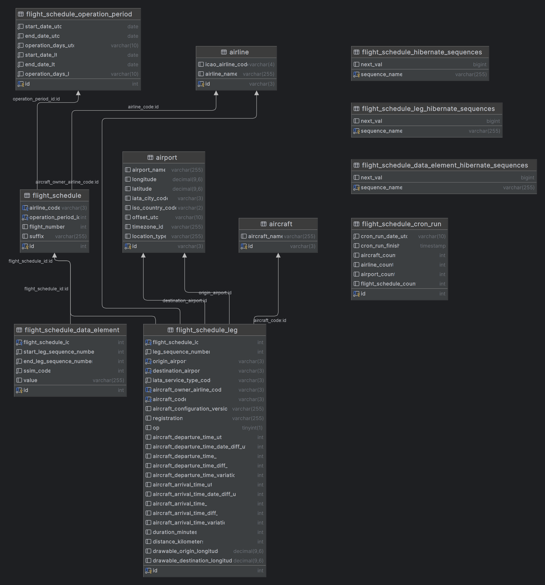

# Flight Visualizer - Database

This directory contains the scripts for setting up the database.

## Model

Generated with IntelliJ IDEA's database tool.

## Hibernate sequences

The only possible 'interesting' part of the database model is the use of Hibernate sequences, which you can see on the
right side of the image.

### Optimization Problem & Solution

**Tl;dr:** Inserting in bulk can be sped by changing from the default GenerationType.IDENTITY to GenerationType.SEQUENCE, does not
work for MySQL though. For more context, credit, and MySQL implementation see below.

When I first started with the project, I had a huge problem with the insertion time for large amounts of data.
So going in to the problem, I first started with optimizing the code, and experimenting with the batch size which
initially helped a lot, but only got me so far.

While researching, I stumbled upon an article that claimed
to ["Boost JPA Bulk Insert Performance by 100x"](https://dzone.com/articles/spring-boot-boost-jpa-bulk-insert-performance-by-100x)
which to be honest did not 100x due to my poor choice of database and use case, but it still helped a ton and brought
insertion time down dramatically.

The essential part was the generation strategy for the id of the entities. Initially I used the GenerationType.IDENTITY,
which is the default for Hibernate, but that was the bottleneck since Hibernate would first insert the
record, then query the record to get the id to re-reference it in another entity. **Very** inefficient for bulk insertion.

So switching to GenerationType.SEQUENCE (or to GenerationType.TABLE in my case), Hibernate would now block a whole
chunk of id's to use, speeding up the insertion. See the above-mentioned article for in depth steps and stats.

Quick side note: It is absolutely unnecessary to have a sequence table for each entity, you can just have one and just
change the name attribute in `@TableGenerator([...])`

For the implementation detail/example,
see [FlightScheduleLeg.java](../flightvisualizer-backend/src/main/java/com/erijl/flightvisualizer/backend/model/entities/FlightScheduleLeg.java)
